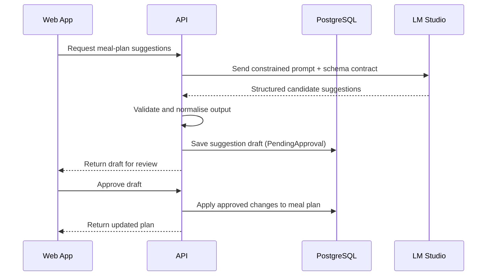

# AI integration (optional module)

## Position in the system

AI suggestions are **optional** and must not be a dependency for core planning and shopping features.

## Safety principles

1. Treat AI output as untrusted input.
2. Validate structured output against strict schemas.
3. Persist suggestions as drafts.
4. Require explicit user approval before changing meal plans.
5. Keep a clear audit trail of prompt, model, output, validation, and approval.

## Suggested flow

## Trade-offs

- Draft-and-approval adds user friction, but avoids unsafe automatic plan edits.
- Strict validation may reject useful but malformed outputs, but preserves data quality.
- Local models improve privacy/control, but quality can vary by model and hardware.

