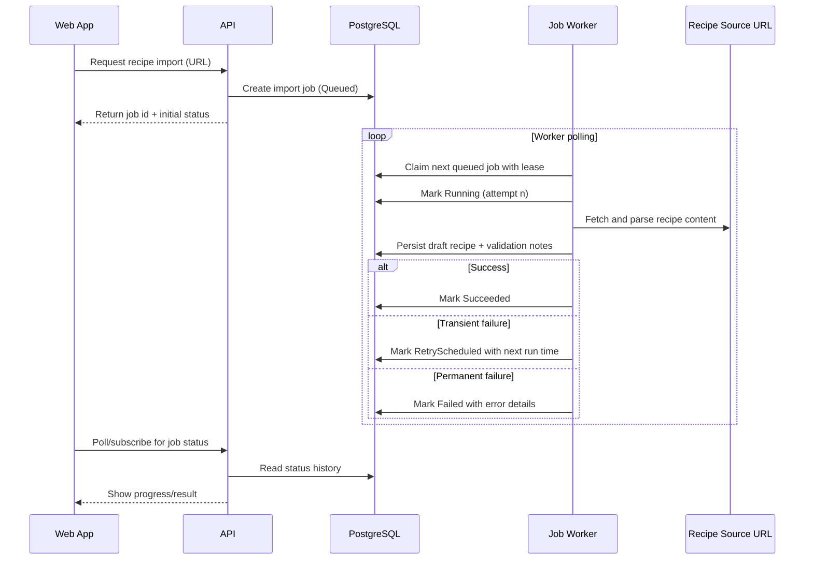

# Background jobs

## Goal

Support long-running and failure-prone work (for example recipe URL imports) without blocking user requests.

## Progressive model

### 1. Simple hosted worker
- Use a basic `IHostedService`/`BackgroundService`.
- Suitable for light periodic work and learning execution lifecycle.
- Limitation: no durable job state across restarts.

### 2. Persisted database jobs
- Store jobs in PostgreSQL with status, timestamps, and payload.
- Worker polls and claims jobs.
- Benefit: visibility, durability, and restart safety.

### 3. Retries, locking, idempotency, cancellation
- Add attempt tracking and retry policy (bounded, explicit backoff).
- Add row-level locking/lease ownership for safe concurrent workers.
- Require idempotency keys and idempotent handlers.
- Support cancellation requests and cooperative cancellation checks.

### 4. Outbox pattern
- Record domain events/messages in an outbox table in the same transaction as business changes.
- Worker publishes/processes outbox rows reliably.
- Reduces “write succeeded but event failed” inconsistencies.

### 5. Optional future Hangfire or queue-based processing
- Reassess only if custom job engine becomes costly to maintain.
- Consider Hangfire or a queue when throughput/operability needs justify it.
- Not required for MVP.

## Long-running recipe import flow

## Guardrails

1. Do not run the same job concurrently.
2. Never assume exactly-once execution; design for safe retries.
3. Keep payloads minimal and versioned.
4. Persist error context for diagnosis.

