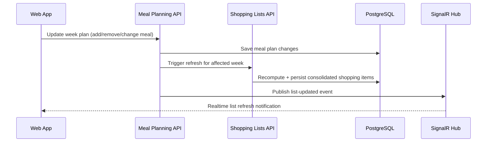

# Module boundaries

## Modules and ownership

| Module | Owns | Responsibilities | Exposes |
| --- | --- | --- | --- |
| Household | Households, memberships | Membership lifecycle, access boundaries | Membership queries, invite/accept operations |
| Recipes | Recipes, ingredients, tags, favourites | Recipe CRUD and search/filter metadata | Recipe read/write operations |
| Meal Planning | Weekly plans and planned meals | Assign recipes to week/day/slot | Plan update operations and plan-changed signals |
| Shopping Lists | Shopping lists and items | Consolidate items from plan, track completion, manual adjustments | List refresh and item state updates |
| Feedback | Ratings and notes | Capture meal outcomes for later suggestions | Feedback create/query operations |
| Jobs (later) | Job records, attempts, locks | Execute long-running tasks safely | Enqueue/cancel/query job status |
| AI Suggestions (later) | Suggestion drafts and approvals | Generate draft suggestions and apply only after approval | Draft create/review/apply operations |

## Boundary rules

1. A module writes only its own tables.
2. Cross-module work happens through explicit application-layer calls or events.
3. Read models may join across modules for API responses, but ownership stays clear.
4. No direct “reach into internals” from one module to another.

## Shopping-list refresh flow (triggered by meal-plan changes)

## Why this split

- Keeps core behaviour understandable while still separating concerns.
- Supports vertical-slice delivery without forcing microservices.
- Makes later extraction possible if a module grows hot or operationally distinct.

