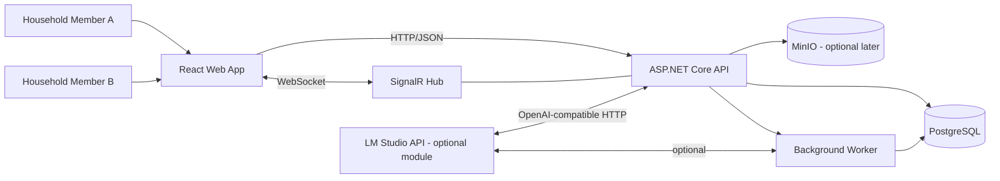

# Architecture overview

## Summary

Table for Two will start as a **modular monolith**: one deployable backend with clear module boundaries, one web client, and one PostgreSQL database.  
The worker runs in the same backend process initially, then evolves to persisted jobs as needed.

## System interaction map

## Design choices

1. Keep data and business behaviour close in feature slices.
2. Treat database state as source of truth; SignalR mirrors state changes.
3. Keep AI and long-running processing optional to core MVP flow.

## Architecture progression

- **MVP**: API + web + PostgreSQL + SignalR, minimal worker capability.
- **Post-MVP**: persisted job engine, recipe import pipeline, optional AI suggestions.
- **Later**: outbox-driven integration reliability and optional queue/Hangfire adoption.

